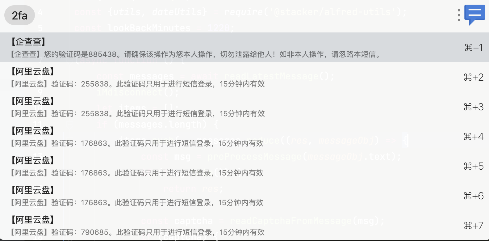
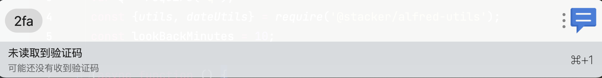

> 读取最近短信验证码消息到剪切板, 用于后续的网页内容填写

## 注意事项
本插件需要在iPhone手机上开启短信转发,并且在Mac的安全隐私设置中给uTools完全磁盘访问权限
    - 短信转发设置: 设置->信息->短信转发  (`允许通过其他已登录iMessage信息账户接收iPhone短信`)

## 使用
1. Type `2fa` to trigger uTools
2. Type`⌘ C` or `⏎` to copy captcha

## 效果

## 原理
Mac上短信数据库位置是放在 `Library/Messages/chat.db` 通过插件读取到并解析出来最近的短信验证码, 然后通过剪切板复制到剪切板

## 鸣谢
- 灵感来源: [squatto](https://github.com/squatto/alfred-imessage-2fa)
- uTools官方
