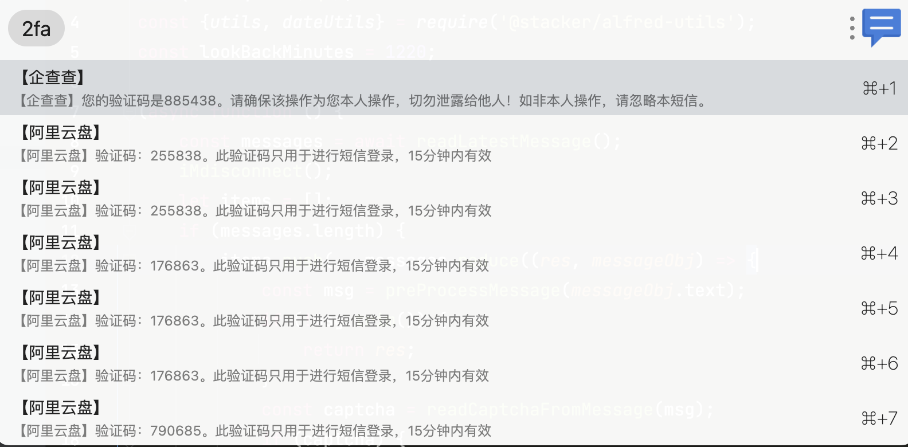
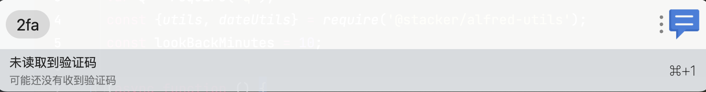

> 读取最近短信验证码消息到剪切板, 用于后续的网页内容填写

## 注意事项
本插件需要在iPhone手机上开启短信转发,并且在Mac的安全隐私设置中给uTools完全磁盘访问权限
    - 短信转发设置: 设置->信息->短信转发  (`允许通过其他已登录iMessage信息账户接收iPhone短信`)

## 使用
1. Type `2fa` to trigger uTools
2. Type`⌘ C` or `⏎` to copy captcha

## 效果




## 原理
Mac上短信数据库位置是放在 `Library/Messages/chat.db` 通过插件读取到并解析出来最近的短信验证码, 然后通过剪切板复制到剪切板

## 开发
> 注意区分`m芯片`和`intel芯片`编译`SQLite3`的方式是不同的,所以不能通用
> 使用`npm install`安装全部依赖后`m芯片`需要再手动安装一次`sqlite3`依赖

### m芯片
```bash
# 卸载原有的sqlite3依赖
npm uninstall sqlite3
# 安装m芯片的sqlite3依赖
npm install sqlite3 --build-from-source --target_arch=arm64 --fallback-to-build
```

如果不想手动安装,在安装全部依赖钱可以使用`npm run install:arm64`命令  
或者直接下载已经编译好的`upx`包使用即可! 
[最新版本下载地址](https://github.com/RipperTs/2fa-read-message-code/releases)

## 问题
- 如果有问题可以在[issues](https://github.com/RipperTs/2fa-read-message-code/issues)中提出,我会尽快解决
- 插件报错后会自动打开日志文件,可以在日志文件中查看错误信息

## 鸣谢
- 灵感来源: [squatto](https://github.com/squatto/alfred-imessage-2fa)
